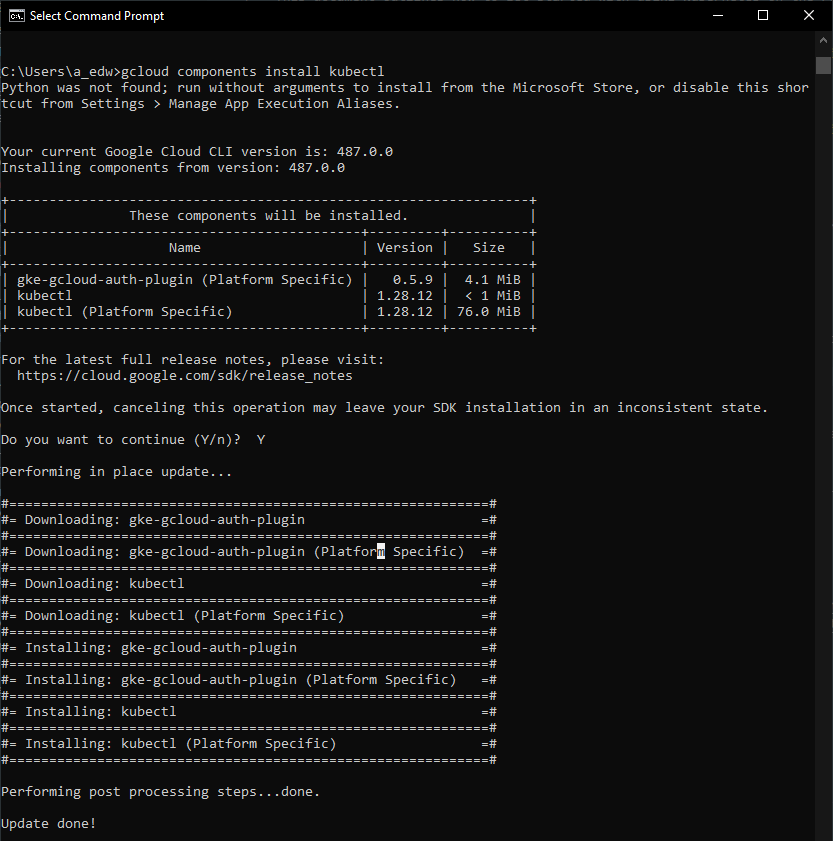
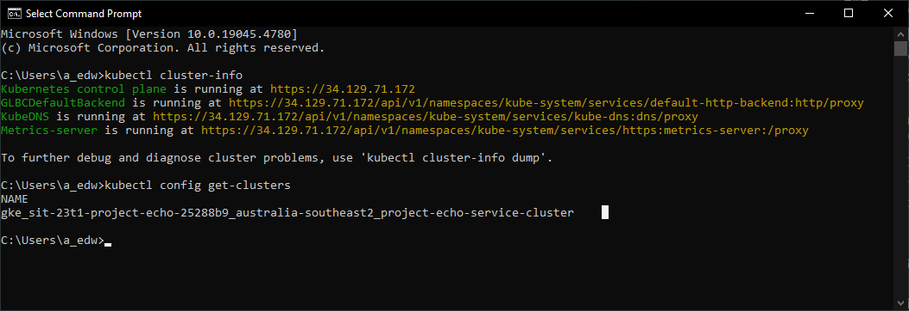

# Getting started with Kubernetes & Google Kubernetes Engine

## Overview
This document outlines how to get started with using Kubernetes on the Project Echo service cluster.

A new command line application is introduced; kubectl. kubectl is used to run commands and deployments on a kubernetes cluster.

## Assumptions
* assumes Setup Terraform For GCP Deployments has been followed and configured. As gcloud cli being installed and authenticated is required.
* assumes the user is using a shell or command prompt.

## Setup Steps
The setup steps will show you how to:
* Installing required components into gcloud cli to enable integration with kubectl
* Authenticate kubectl with the service cluster.

### Install required components for gcloud kubectl integration
Run the following command to install the gcloud kubectl auth plugin and kubectl.

```
gcloud components install kubectl
```

Enter "Y" and hit enter when prompted as you do want to install the components. That's all it should take.



### Authenicate with the service cluster.
Run the following command to authenciate with the service cluster for the project.

```
gcloud container clusters get-credentials project-echo-service-cluster --region=australia-southeast2
```

### Confirm setup
Use the following commands to verify that kubectl is installed, authenticated and working with the service cluster.

```
kubectl cluster-info
kubectl config get-clusters
```



## Reference Links
https://cloud.google.com/kubernetes-engine/docs/how-to/cluster-access-for-kubectl#install_plugin
https://cloud.google.com/kubernetes-engine/docs/how-to/api-server-authentication
